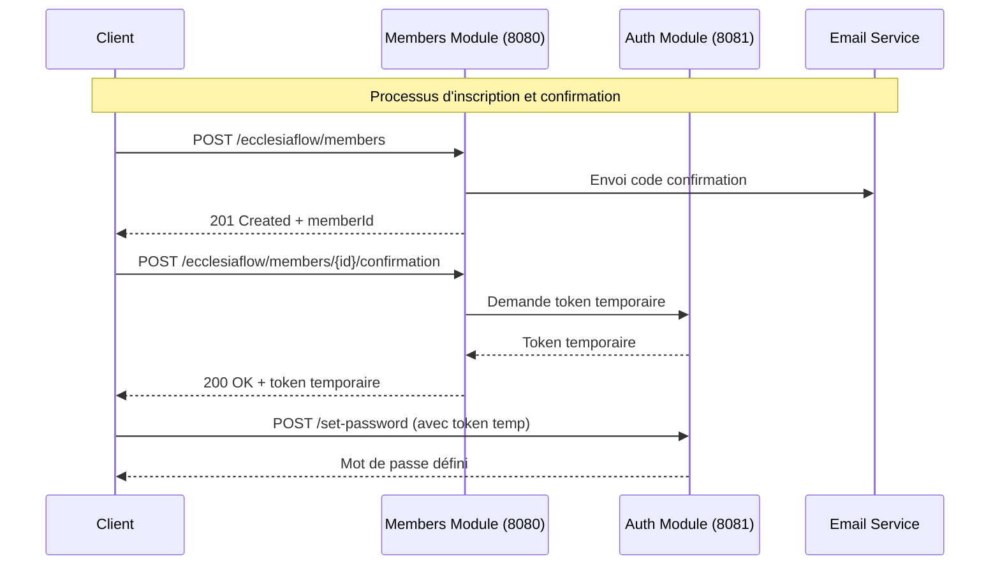

# EcclesiaFlow Members Module

[](https://openjdk.java.net/projects/jdk/21/)
[](https://spring.io/projects/spring-boot)
[](https://dev.mysql.com/downloads/mysql/)
[](LICENSE)
[](https://swagger.io/specification/)

> **Module de gestion des membres pour la plateforme EcclesiaFlow**

Module microservice dédié à la gestion complète des membres d'églises : inscription, confirmation par email, gestion des profils et intégration avec le module d'authentification. Conçu selon les principes de Clean Architecture avec une séparation claire des responsabilités.

---

## Table des matières

- [Overview](#overview)
- [Fonctionnalités du Module](#fonctionnalités-du-module)
- [Structure du Projet](#structure-du-projet)
- [Architecture Multi-Tenant](#architecture-multi-tenant)
- [Architecture Clean - 4 Couches](#architecture-clean---4-couches)
- [Écosystème EcclesiaFlow](#écosystème-ecclesiaflow)
- [Stack Technologique](#stack-technologique)
- [Quick Start](#quick-start)
- [Exemples d'API (cURL + jq)](#exemples-dapi-curl--jq)
- [Configuration](#configuration)
- [Déploiement Docker](#déploiement-docker)
- [Tests et Qualité](#tests-et-qualité)
- [Contributing](#contributing)
- [License](#license)

---

## 🚀 Overview

Le **EcclesiaFlow Members Module** est un microservice spécialisé dans la gestion complète des membres d'églises. Il fait partie de l'écosystème EcclesiaFlow, une plateforme SaaS multi-tenant où chaque église fonctionne comme un tenant indépendant.

### 🎯 **Responsabilités du Module**

- **Gestion des membres** : Inscription, profils, mise à jour des informations
- **Processus de confirmation** : Validation par email avec codes temporaires  
- **Intégration Auth** : Communication avec le module d'authentification pour les tokens
- **Notifications** : Envoi automatique d'emails de confirmation
- **Architecture Clean** : Séparation claire des couches (Web, Business, IO, Shared)



---

## ✨ Fonctionnalités du Module

* 👥 **Gestion des Membres** – CRUD complet des profils membres avec validation métier
* ✉️ **Confirmation par Email** – Processus sécurisé avec codes temporaires (6 chiffres)
* 🔗 **Intégration Auth Module** – Communication WebClient pour tokens temporaires
* 📧 **Notifications Email** – Service SMTP intégré avec templates personnalisables
* 🏗️ **Clean Architecture** – 4 couches : Web, Business, IO, Shared
* 📚 **API-First Design** – Documentation OpenAPI complète avec schémas détaillés
* 🧪 **Tests Complets** – Couverture JaCoCo avec tests unitaires et d'intégration
* 🔄 **Logging AOP** – Aspects métier et techniques pour monitoring
* 🛡️ **Gestion d'Erreurs** – GlobalExceptionHandler avec réponses standardisées

---

## 📁 Structure du Projet

```
ecclesiaflow-members-module/
├── src/
│   ├── main/
│   │   ├── java/com/ecclesiaflow/
│   │   │   ├── MembersModuleApplication.java
│   │   │   ├── business/                    # Couche Business
│   │   │   │   ├── domain/
│   │   │   │   └── services/
│   │   │   ├── io/                          # Couche IO
│   │   │   │   ├── persistence/
│   │   │   │   ├── communication/
│   │   │   │   └── notification/
│   │   │   ├── shared/                      # Couche Shared
│   │   │   │   ├── code/
│   │   │   │   └── logging/
│   │   │   └── web/                         # Couche Web
│   │   │       ├── controller/
│   │   │       ├── dto/
│   │   │       ├── mappers/
│   │   │       ├── client/
│   │   │       ├── config/
│   │   │       ├── security/
│   │   │       └── exception/
│   │   └── resources/
│   │       ├── api/
│   │       │   └── members.yaml             # API-First OpenAPI
│   │       └── application.properties.example
│   └── test/java/com/ecclesiaflow/          # Tests
│       ├── business/
│       ├── web/
│       └── io/
├── target/
├── pom.xml
├── README.md
├── LICENSE
└── .env.example
```

---

## 🏛️ Architecture Multi-Tenant

### Architecture Cible

```
┌─────────────────────────────────────────────────────────────┐
│                    SUPER ADMIN                              │
├─────────────────────────────────────────────────────────────┤
│  TENANT 1 (Église A)    │  TENANT 2 (Église B)    │ ...    │
│  ┌─────────────────────┐ │ ┌─────────────────────┐  │        │
│  │ Pastor (Admin)      │ │ │ Pastor (Admin)      │  │        │
│  │ ├─ Member 1         │ │ │ ├─ Member 1         │  │        │
│  │ ├─ Member 2         │ │ │ ├─ Member 2         │  │        │
│  │ └─ ...              │ │ │ └─ ...              │  │        │
│  └─────────────────────┘ │ └─────────────────────┘  │        │
└─────────────────────────────────────────────────────────────┘
```

### Rôles et Responsabilités

- **Super Admin** : Gestion globale de tous les tenants (églises)
- **Pastor (Admin Tenant)** : Administration de son église, gestion des membres
- **Members** : Membres de l'église avec profils et participations

---

## 🏗️ Architecture Clean - 4 Couches

Le module suit les principes de **Clean Architecture** avec une séparation claire des responsabilités :

### 📱 **Couche Web** (`com.ecclesiaflow.web`)
- **Controllers** : `MembersController`, `MembersConfirmationController`
- **DTOs** : `SignUpRequest`, `SignUpResponse`, `ConfirmationRequest`, `ConfirmationResponse`
- **Mappers** : Conversion entre DTOs et objets domaine
- **Config** : `OpenApiConfig`, `WebClientConfig`
- **Exceptions** : `GlobalExceptionHandler`, exceptions métier

### 🏢 **Couche Business** (`com.ecclesiaflow.business`)
- **Services** : `MemberService`, `MemberConfirmationService`
- **Domain** : `Member`, `MemberRepository`, `MemberConfirmation`
- **Interfaces** : Contrats pour les services externes

### 💾 **Couche IO** (`com.ecclesiaflow.io`)
- **Persistence** : Entités JPA, repositories Spring Data
- **Communication** : `EmailServiceImpl`, `AuthClient`
- **Mappers** : Conversion entre entités et objets domaine

### 🔧 **Couche Shared** (`com.ecclesiaflow.shared`)
- **Logging** : Aspects AOP pour logging métier et technique
- **Utils** : `ConfirmationCodeGenerator`, annotations communes

## 📦 Écosystème EcclesiaFlow

* **Members Module** (Ce module)
  **Port**: 8080
  **Rôle**: Gestion des membres et confirmation par email

* **Authentication Module**
  🔗 [GitHub Repo](https://github.com/GYOM15/ecclesiaflow-auth-module)
  **Port**: 8081
  **Rôle**: Authentification JWT et gestion des mots de passe

---

## 🛠 Stack Technologique

* **Backend**: Java 21, Spring Boot 3.5.5
* **Base de Données**: MySQL 9.0.0 avec Spring Data JPA
* **Communication**: Spring WebFlux, WebClient (Auth Module)
* **Email**: Spring Boot Mail avec SMTP Gmail
* **Documentation**: OpenAPI 3.1.1, SpringDoc, Swagger UI
* **Build**: Maven 3.14.0 avec plugins optimisés
* **Tests**: JUnit 5, Mockito 5.14.2, JaCoCo 0.8.11
* **Logging**: AOP avec AspectJ, SLF4J
* **Architecture**: Clean Architecture, Microservices, SOLID

---

## ⚡ Quick Start

### 1. Prérequis

* **Java 21+** (OpenJDK ou Oracle JDK)
* **Maven 3.8+** pour la gestion des dépendances
* **MySQL 9.0+** (ou MySQL 8.0+ compatible)
* **IDE** (IntelliJ IDEA recommandé avec support Lombok)
* **Auth Module** en cours d'exécution sur le port 8081

### 2. Clone du Projet

```bash
git clone https://github.com/GYOM15/ecclesiaflow-members-module.git
cd ecclesiaflow-members-module
```

### 3. Configuration Base de Données

```sql
-- Base de données Members Module
CREATE DATABASE ecclesiaflow_members;
CREATE USER 'ecclesiaflow'@'localhost' IDENTIFIED BY 'your_secure_password';
GRANT ALL PRIVILEGES ON ecclesiaflow_members.* TO 'ecclesiaflow'@'localhost';
FLUSH PRIVILEGES;
```

### 4. Configuration de l'Application

```bash
# Copier le fichier de configuration exemple
cp src/main/resources/application.properties.example src/main/resources/application.properties

# Éditer avec vos vraies valeurs
nano src/main/resources/application.properties
```

**Variables obligatoires à configurer :**
```properties
# Base de données
spring.datasource.url=jdbc:mysql://localhost:3306/ecclesiaflow_members
spring.datasource.username=ecclesiaflow
spring.datasource.password=your_secure_password

# Email SMTP (Gmail)
spring.mail.username=your-email@gmail.com
spring.mail.password=your_gmail_app_password

# Auth Module
ecclesiaflow.auth.module.base-url=http://localhost:8081
```

### 5. Démarrage du Module

```bash
# Compilation et tests
mvn clean compile test

# Démarrage en mode développement
mvn spring-boot:run

# Ou avec profil spécifique
mvn spring-boot:run -Dspring-boot.run.profiles=dev
```

### 6. Vérification du Démarrage

```bash
# Health check
curl http://localhost:8080/actuator/health

# Documentation API
open http://localhost:8080/swagger-ui.html

# Test endpoint
curl http://localhost:8080/ecclesiaflow/hello
```

---

## 🔑 Exemples d'API (cURL + jq)

### 📝 **Inscription d'un Membre**

```bash
# 1. Inscription d'un nouveau membre
curl -X POST "http://localhost:8080/ecclesiaflow/members" \
  -H "Content-Type: application/vnd.ecclesiaflow.members.v1+json" \
  -d '{
    "firstName": "Jean",
    "lastName": "Dupont", 
    "email": "jean.dupont@example.com",
    "address": "123 Rue de la Paix, Paris"
  }' | jq .
```

### ✅ **Confirmation du Compte**

```bash
# 2. Confirmation avec le code reçu par email
curl -X POST "http://localhost:8080/ecclesiaflow/members/550e8400-e29b-41d4-a716-446655440000/confirmation" \
  -H "Content-Type: application/vnd.ecclesiaflow.members.v1+json" \
  -d '{
    "code": "123456"
  }' | jq .

# Réponse : 200 OK
# {
#   "message": "Compte confirmé avec succès",
#   "temporaryToken": "eyJhbGciOiJIUzI1NiIsInR5cCI6IkpXVCJ9...",
#   "memberId": "550e8400-e29b-41d4-a716-446655440000"
# }
```

### 🔄 **Renvoyer un Code de Confirmation**

```bash
# 3. Renvoyer un nouveau code de confirmation
curl -X POST "http://localhost:8080/ecclesiaflow/members/550e8400-e29b-41d4-a716-446655440000/confirmation-code" \
  -H "Content-Type: application/vnd.ecclesiaflow.members.v1+json" | jq .
```

---

## ⚙️ Configuration

### 🗃️ **Variables Base de Données**

```properties
# Configuration MySQL
spring.datasource.url=jdbc:mysql://localhost:3306/ecclesiaflow_members
spring.datasource.username=ecclesiaflow
spring.datasource.password=your_secure_password
spring.datasource.driver-class-name=com.mysql.cj.jdbc.Driver

# JPA/Hibernate
spring.jpa.hibernate.ddl-auto=update
spring.jpa.show-sql=false
spring.jpa.properties.hibernate.dialect=org.hibernate.dialect.MySQLDialect
```

### 📧 **Configuration Email SMTP**

```properties
# Gmail SMTP (recommandé)
spring.mail.host=smtp.gmail.com
spring.mail.port=587
spring.mail.username=your-email@gmail.com
spring.mail.password=your_gmail_app_password
spring.mail.properties.mail.smtp.auth=true
spring.mail.properties.mail.smtp.starttls.enable=true

# Configuration EcclesiaFlow
ecclesiaflow.mail.from=your-email@gmail.com
ecclesiaflow.app.name=EcclesiaFlow
```

### 🔗 **Intégration Auth Module**

```properties
# URL du module d'authentification
ecclesiaflow.auth.module.base-url=http://localhost:8081
```

### 📚 **Documentation OpenAPI**

```properties
# SpringDoc OpenAPI
springdoc.api-docs.path=/api-docs
springdoc.swagger-ui.path=/swagger-ui.html
springdoc.paths-to-match=/ecclesiaflow/**
springdoc.packages-to-scan=com.ecclesiaflow.web.controller
```

### 🔧 **Variables d'Environnement (.env)**

```bash
# Base de données
DB_HOST=localhost
DB_PORT=3306
DB_NAME=ecclesiaflow_members
DB_USERNAME=ecclesiaflow
DB_PASSWORD=your_secure_password

# Email
MAIL_USERNAME=your-email@gmail.com
MAIL_PASSWORD=your_gmail_app_password
MAIL_FROM=your-email@gmail.com

# Services externes
AUTH_MODULE_BASE_URL=http://localhost:8081

# Serveur
SERVER_PORT=8080
SPRING_PROFILES_ACTIVE=dev
```

---

## 🐳 Déploiement Docker

### **Dockerfile**

```dockerfile
FROM openjdk:21-jdk-slim

WORKDIR /app

# Copier les fichiers Maven
COPY pom.xml .
COPY mvnw .
COPY .mvn .mvn

# Télécharger les dépendances
RUN ./mvnw dependency:go-offline -B

# Copier le code source
COPY src src

# Construire l'application
RUN ./mvnw clean package -DskipTests

# Exposer le port
EXPOSE 8080

# Démarrer l'application
CMD ["java", "-jar", "target/ecclesiaflow-members-module-1.0.0-SNAPSHOT.jar"]
```

### **Docker Compose**

```yaml
version: '3.8'
services:
  members-module:
    build: .
    ports:
      - "8080:8080"
    environment:
      - SPRING_PROFILES_ACTIVE=docker
      - DB_HOST=mysql
      - DB_NAME=ecclesiaflow_members
      - DB_USERNAME=ecclesiaflow
      - DB_PASSWORD=${DB_PASSWORD}
      - AUTH_MODULE_BASE_URL=http://auth-module:8081
      - MAIL_USERNAME=${MAIL_USERNAME}
      - MAIL_PASSWORD=${MAIL_PASSWORD}
    depends_on:
      mysql:
        condition: service_healthy
    networks:
      - ecclesiaflow-network

  mysql:
    image: mysql:9.0
    environment:
      MYSQL_ROOT_PASSWORD: ${MYSQL_ROOT_PASSWORD}
      MYSQL_DATABASE: ecclesiaflow_members
      MYSQL_USER: ecclesiaflow
      MYSQL_PASSWORD: ${DB_PASSWORD}
    volumes:
      - mysql_data:/var/lib/mysql
    healthcheck:
      test: ["CMD", "mysqladmin", "ping", "-h", "localhost"]
      timeout: 20s
      retries: 10
    networks:
      - ecclesiaflow-network

volumes:
  mysql_data:

networks:
  ecclesiaflow-network:
    external: true
```

---

## 🧪 Tests et Qualité

### **Exécution des Tests**

```bash
# Tests unitaires uniquement
mvn test

# Tests avec couverture JaCoCo
mvn clean test jacoco:report

# Voir le rapport de couverture
open target/site/jacoco/index.html

# Tests d'intégration
mvn verify -P integration-tests
```

### **Structure des Tests**

```
src/test/java/com/ecclesiaflow/
├── business/
│   ├── services/impl/          # Tests services métier
│   └── aspect/                 # Tests aspects AOP
├── web/
│   ├── controller/             # Tests contrôleurs REST
│   └── exception/              # Tests gestion d'erreurs
└── io/
    └── persistence/            # Tests repositories
```

### **Métriques Qualité**

- **Couverture JaCoCo** : Minimum 80% par package
- **Tests unitaires** : Mockito avec strictness LENIENT
- **Tests d'intégration** : TestContainers pour MySQL
- **Architecture** : ArchUnit pour validation des couches

---

## 🤝 Contributing

### **Standards de Développement**

- **Clean Architecture** : Respecter la séparation des 4 couches
- **SOLID Principles** : Chaque classe a une responsabilité unique
- **Documentation** : Javadoc complète pour toutes les classes publiques
- **Tests** : Couverture minimale de 80% avec tests unitaires et d'intégration

### **Workflow Git**

```bash
# 1. Partir de la branche de développement
git checkout members-module-dev

# 2. Créer une branche pour la nouvelle fonctionnalité
git checkout -b nouvelle-fonctionnalite

# 3. Développer avec commits atomiques
git commit -m "feat(members): Add email validation"

# 4. Tests et qualité
mvn clean test jacoco:report

# 5. Push et Pull Request vers members-module-dev
git push origin nouvelle-fonctionnalite
```

### **Convention de Commits**

**Format avec type :**
```
type(scope): Description (≤ 50 caractères, 1ere lettre en)

Corps du message (≤ 72 caractères par ligne)

Types: feat, fix, docs, style, refactor, test, chore
Scopes: members, confirmation, email, persistence, web
```

**Format sans type :**
```
Add nouvelle fonctionnalité (≤ 50 caractères, 1ere lettre en majuscule)

Corps du message détaillé si nécessaire
(≤ 72 caractères par ligne)
```

**Exemples :**
- `feat(members): Add email validation service`
- `fix(confirmation): Resolve code expiration issue`  
- `Add comprehensive member profile validation`
- `Update OpenAPI documentation for new endpoints`

---

## 📄 License

MIT – see [LICENSE](LICENSE)

---

**Developed with ❤️ for church communities worldwide**

